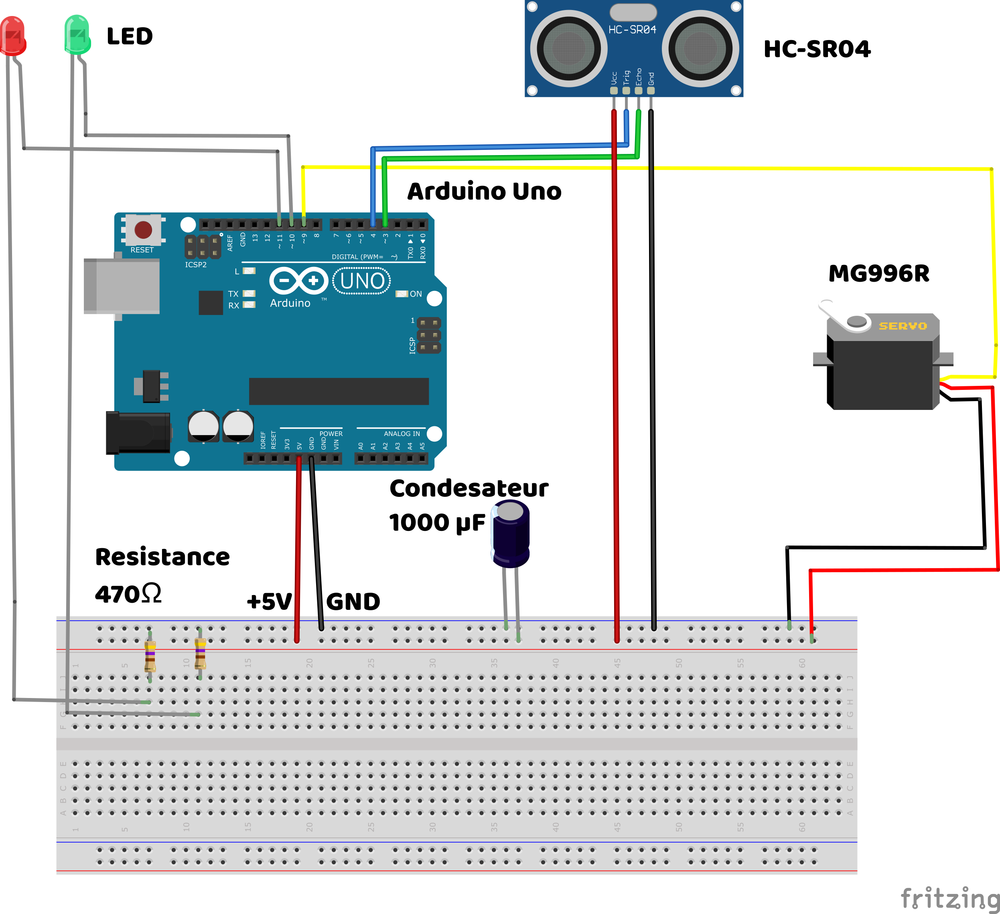

# Electr04-Barriere-Automatique

Ce projet Arduino te permet de créer un système de barrière automatique à l’aide d’une Arduino Uno, d’un servomoteur et d’un module à ultrasons HC-SR04.
Pour le rendre plus réaliste, des LEDs sont utilisées afin de fournir un signal visuel.

Amuse-toi bien en reproduisant ce projet !

---

## 🛠 Matériel nécessaire

- Arduino Uno
- Alimentation externe 5V (2-3A)
- Servomoteur MG996R
- Capteur ultrason HR-SC04
- Breadboard
- Led rouge
- Led verte
- Resistance 470 
- Câbles Male/Male
- Câbles Male/Femelle
- Maquette découpé en contreplaqué ou en carton découpé au laser (schéma dans le dossier Schéma).
- Vis diamètre 3mm longeur 16mm x2
- Ecrou diamètre 3mm x2
- (Optionnel) Condensateur 1000 µF (pour stabiliser l’alimentation du servo)
---

## 🔌 Schéma de câblage

| Composant         | Arduino         |
|-------------------|-----------------|
| HC-SR04 VCC		| 5V              |
| HC-SR04 Echo		| D3              |
| HC-SR04 Trig		| D4              |
| HC-SR04 GND 		| GND             |
| Signal Servo      | D9              |
| Led verte         | D10             |
| Led rouge         | D10             |
| VCC Servo         | 5V     	      |
| GND Servo         | GND       	  |
| Alimentation 5V   | 5V (commun)     |
| Alimentation GND  | GND (commun)    |




> ⚠️ Le MG996R peut consommer jusqu’à 2.5 A : ne pas l’alimenter directement depuis l’Arduino. Utilise une alimentation externe 5V bien régulée, et connecte sa masse à celle de l’Arduino.

---

## 🧠 Fonctionnement


- Le capteur à ultrasons détecte la présence d’un véhicule.
- La barrière s’ouvre.
- Le feu rouge s’éteint.
- Le feu vert s’allume.


---

## 💾 Code Arduino

```cpp
#include <Servo.h>

// Déclaration du servo
Servo barriereServo;

// Définition des pins
const int trigPin = 4;      // Pin Trigger du HC-SR04
const int echoPin = 3;     // Pin Echo du HC-SR04
const int ledRouge = 11;     // LED rouge
const int ledVerte = 10;     // LED verte
const int servoPin = 9;     // Servo moteur MG996R

// Distance minimale pour détecter un obstacle (ici 5 cm)
const int distanceSeuil = 5;

void setup() {
  Serial.begin(9600);             // Initialisation de la communication série
  pinMode(trigPin, OUTPUT);       // Trigger en sortie
  pinMode(echoPin, INPUT);        // Echo en entrée
  pinMode(ledRouge, OUTPUT);      // LED rouge en sortie
  pinMode(ledVerte, OUTPUT);      // LED verte en sortie

  barriereServo.attach(servoPin); // Attacher le servo au pin défini
  barriereServo.write(90);        // Barrière initialement fermée (position 90°)
}

void loop() {
  // Envoi de l'impulsion sur le trigger
  digitalWrite(trigPin, LOW);
  delayMicroseconds(2);
  digitalWrite(trigPin, HIGH);
  delayMicroseconds(10);
  digitalWrite(trigPin, LOW);

  // Lecture de la durée de l'impulsion Echo
  long duree = pulseIn(echoPin, HIGH);

  // Conversion du temps en distance (cm)
  int distance = duree * 0.034 / 2;

  Serial.print("Distance : ");
  Serial.print(distance);
  Serial.println(" cm");

  if (distance <= distanceSeuil) {
    // Objet détecté à proximité
    digitalWrite(ledRouge, LOW);     // Éteindre la LED rouge
    digitalWrite(ledVerte, HIGH);    // Allumer la LED verte
    barriereServo.write(90);          // Ouvrir la barrière (0°)
    delay(2000);                     // On attend 2 secondes
  } else {
    // Pas d'objet détecté
    digitalWrite(ledRouge, HIGH);    // Allumer la LED rouge
    digitalWrite(ledVerte, LOW);     // Éteindre la LED verte
    barriereServo.write(0);         // Fermer la barrière (90°)
  }

  delay(200); // Délai pour éviter les déclenchements trop fréquents
}
``` 
---

## 📷 Assemblage


> Colle le support du module HC-SR04 sur la maquette.


> Colle le support du servomoteur et des LED sur la maquette.
> ⚠️ Attention : le trou des LED doit se trouver à droite.


> Installe le servomoteur sur son support à l’aide des deux vis M3 de 16 mm et des écrous.


Fixe la barrière au servomoteur à l’aide des rislans.


> Colle les LEDs au support.
> La LED verte se trouve à droite.


> Colle le module HC-SR04 au support.


> Réalise les branchements en suivant le schéma.


> Upload le code, ajoute l'alimentation 5V et test ta création !

Montage final


---

## 📷  Démonstration

GIF

---

## 🎥 Vidéo Youtube


---

## 📝 Le petit mot de la fin

J’espère que le projet t’a plu et que tu t’es amusé !
Si ce type de projet t’intéresse, n’hésite pas à liker et partager un maximum sur les réseaux.
Tu peux aussi laisser un commentaire si tu as réussi à le reproduire !

---

## ✍️ Nos projets

IronLab — Passionné d'électronique, robotique & projets DIY  

[YouTube](https://youtube.com/@ironlab_974) | [TikTok](https://www.tiktok.com/@ironlab_974) | [Instagram](https://www.instagram.com/ironlab_974)

AquaLab — La téchnologie au service du monde marin & chasse au trésor.

[YouTube](https://youtube.com/@aqualab_974) | [TikTok](https://www.tiktok.com/@aqualab_974) | [Instagram](https://www.instagram.com/aqualab_974)

Corail Création — Notre boutique

[TikTok](https://www.tiktok.com/@corail.creation) | [Instagram](https://www.instagram.com/corail.creation) | [Site marchand](https://www.corail-creation.re)

---

## 🔗 Ressources utiles

- [Documentation Servo Arduino](https://www.arduino.cc/en/reference/servo)
- [Utilisation HC-SR04](https://www.upesy.com/blogs/tutorials/hc-sr04-ultrasonic-sensor-on-esp32-with-arduino-code-tutorial?shpxid=973debb0-c2ce-40a4-9d4e-4f064c9e8d46)
- [Datasheet MG996R](https://www.electronicoscaldas.com/datasheet/MG996R_Tower-Pro.pdf)

---

## 📄 Licence

Ce projet est open-source, sous licence MIT.  
N'hésitez pas à le modifier, le partager ou y contribuer.